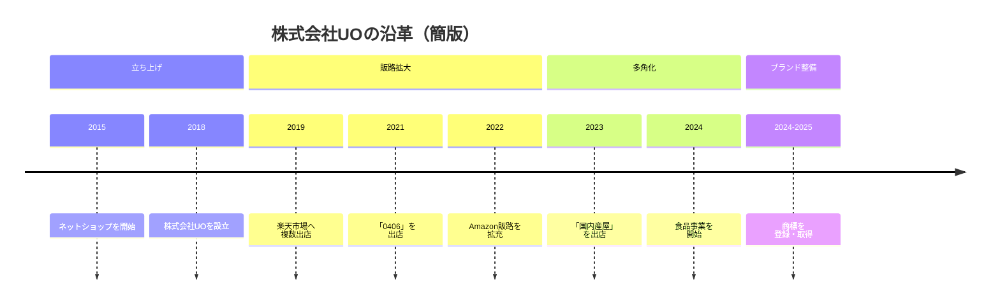

# 会社概要

## 基本情報

| 項目 | 内容 |
| --- | --- |
| 会社名 | 株式会社UO |
| 代表取締役 | 王 克兢 |
| 設立 | 2018年 |
| 所在地 | 兵庫県神戸市長田区菅原通2-23 No.88ビル3F |
| 従業員数 | 20名 |
| 年商 | 2億1千万円（2024年度） |
| 本社・工場 | 神戸市 |
| 主な販売チャネル | 楽天市場 / Amazon / Alibaba（中国） |

## 事業内容

- **スマートフォン全機種ケースのOEM・加工・卸販売**
- **中国からのオーダーメイド直輸入卸・販売**
- **日本から中国への出品を含む越境連携**
- **国内産食品のEC販売事業**

## 事業体制

株式会社UOは、**EC店舗の運営に加え、商品企画、加工、卸販売、越境連携までを一体で進める体制**を構築しています。  
**販売現場で得た顧客理解を、次の商品展開や新規事業へとつなげている点**が、当社の特徴です。

<!--
生成画像プロンプト:
A clean corporate infographic-style visual for a Japanese company, showing integrated business flow: product planning, OEM manufacturing, processing, e-commerce operations, cross-border coordination between Japan and China, shipping and customer delivery, minimal and elegant, deep blue and silver tone, modern corporate style, no text, no logo, no watermark, 16:9
-->

::: info 株式会社UOの強み
- EC運営、商品企画、加工、卸販売を一体で進められる体制
- 多機種対応、オーダーメイド、小ロット対応の柔軟性
- 日本国内販売に加え、中国との連携も視野に入れた事業基盤
:::

## 沿革

### 簡版沿革

左右にスクロールできます

### 詳細沿革

::: timeline 2015年
**ネットショップを開始**  
スマートフォンアクセサリー販売の取り組みをスタートしました。
:::

::: timeline 2018年
**株式会社UOを設立**  
事業基盤を法人として整え、本格的な展開を進める体制を構築しました。
:::

::: timeline 2019年
**楽天市場に「松武商店」「3911」「天海スポーツ」を出店**  
主要なオンライン販路を拡大し、販売体制を強化しました。
:::

::: timeline 2021年
**楽天市場に「0406」を出店**  
ショップ展開を広げ、EC運営の基盤をさらに強化しました。
:::

::: timeline 2022年
**Amazonに「UOWORLD3911」「幸田良品」を出店**  
楽天市場に加えて Amazon での販売チャネルを拡充しました。
:::

::: timeline 2023年
**Amazonに「国内産屋」を出店**  
新たなブランド展開に向けた土台づくりを進めました。
:::

::: timeline 2024年4月
**国内産食品ネット販売の新プロジェクトを開始**  
スマートフォンアクセサリー事業で培った運営ノウハウを、新しいカテゴリへ展開し始めました。
:::

::: timeline 2024年7月
**「国内産屋」を商標登録**  
食品事業のブランド整備を進め、対外的な基盤を固めました。
:::

::: timeline 2025年2月
**「国内産屋」の商標を取得**  
ブランド展開を支える権利面の整備を完了しました。
:::

## 関連ページ

- [代表挨拶](../message/)
- [会社情報](../)
- [事業案内](/services/)
