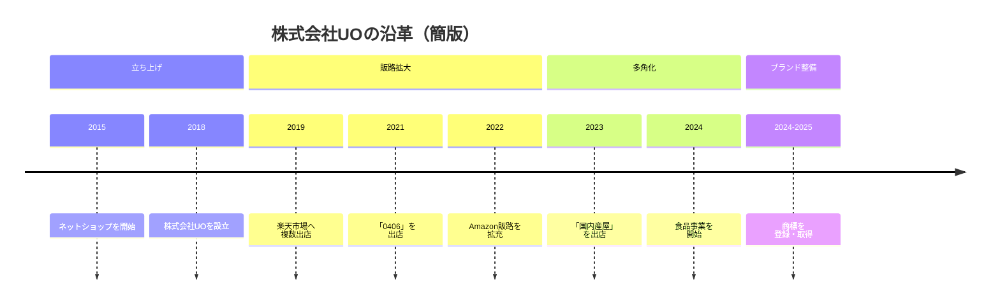

# 会社概要

## 基本情報

| 項目 | 内容 |
| --- | --- |
| 会社名 | 株式会社UO |
| 代表取締役 | 王 克兢 |
| 設立 | 2018年 |
| 所在地 | 兵庫県神戸市長田区菅原通2-23 No.88ビル2F |
| 従業員数 | 20名 |
| 年商 | 3億円（2025年度） |
| 本社・工場 | 神戸市 |
| 主な販売チャネル | 楽天市場 / メルカリ / Amazon / auPay Market / Qoo10 / Temu / Alibaba（中国） |

## 事業内容

- **スマートフォン全機種ケースのOEM・加工・卸販売**
- **食品・グローバル特産品直輸入卸・販売**
- **AI・システム開発**
- **B2B卸売・日中貿易**

## 事業体制

株式会社UOは、**EC店舗の運営に加え、商品企画、加工、卸販売、越境連携までを一体で進める体制**を構築しています。
**販売現場で得た顧客理解を、次の商品展開や新規事業へとつなげている点**が、当社の特徴です。

<!--
生成画像プロンプト:
A clean corporate infographic-style visual for a Japanese company, showing integrated business flow: product planning, OEM manufacturing, processing, e-commerce operations, cross-border coordination between Japan and China, shipping and customer delivery, minimal and elegant, deep blue and silver tone, modern corporate style, no text, no logo, no watermark, 16:9
-->

::: info 株式会社UOの強み

- **EC運営、商品企画、加工、卸販売を一体で進められる体制**
- **強靭な自社サプライチェーンおよび高度な品質管理基盤**
- **実戦から生まれた最先端AIソリューション**
- **圧倒的なオンライン実績とOMO（融合）戦略**
- **ホスピタリティあふれる顧客体験（CRM）**
- **多様なバックグラウンドを持つグローバル・プロフェッショナル集団**
:::

## 沿革

現場の一担当者としての原点から、自社ブランドの確立、そしてテクノロジー企業の側面を併せ持つ総合商貿グループへと成長を続けております。

### 簡版沿革

左右にスクロールできます

### 詳細沿革

::: timeline 2012年
**原点**
創業者がスマートフォンアクセサリー貿易会社に参画。日中サプライチェーンの基礎を構築。
:::

::: timeline 2013年
**蓄積**
楽天市場の大手店舗に参画。ECプラットフォームの最前線において、検索アルゴリズムと店舗運営に関する深い実戦ノウハウを蓄積。
:::

::: timeline 2015年
**参入**
ネットショップを開設し、オーダーメイドを中心としたファッショナブルなスマートフォンケースの販売を開始。
:::

::: timeline 2018年
**法人化**
株式会社UOを設立し、組織的な事業展開を本格的にスタート。
:::

::: timeline 2019年
**多店舗展開**
楽天市場に「3911」「十色生活」などを出店し、ブランドマトリックスを形成。
:::

::: timeline 2021年
**飛躍**
ショップ開設からわずか数年で特定店舗の売上が1億円を突破し、楽天市場全体で売上ランク31位を獲得する快挙を達成。
:::

::: timeline 2024年
**多角化**
食品販売事業に参入し、「国内産屋」プロジェクトを開始 。日中両国でのサプライヤー開拓を強化。
:::

::: timeline 2025年
**テクノロジー元年**
最先端AIを用いたオフィス・倉庫・EC運営の統合管理ソフトウェアを自社開発し、現場への実装を完了。AI開発を担う重要事業部が発足。
:::

::: timeline 2026年
**全チャネル展開**
オンライン専業からの事業モデル転換。厳しい品質基準をクリアし、関東の大型商業施設（大手雑貨店）へのB2B卸売を正式に開始。実店舗でのブランド構築を推進し、全方位型のECソリューション企業としての地位を確立。
:::

## 関連ページ

- [代表挨拶](../message/)
- [会社情報](../)
- [事業案内](/services/)
