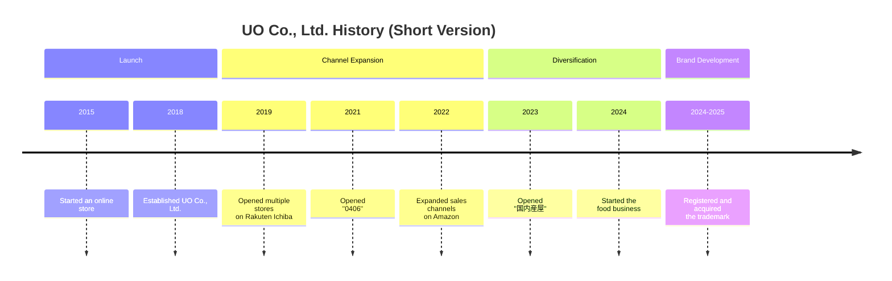

# Company Profile

## Basic Information

| Item | Details |
| --- | --- |
| Company Name | UO Co., Ltd. |
| Representative Director | Wang Kejing |
| Established | 2018 |
| Address | No.88 Building 2F, 2-23 Sugawara-dori, Nagata-ku, Kobe, Hyogo, Japan |
| Employees | 20 |
| Annual Revenue | JPY 210 million (FY2024) |
| Headquarters / Factory | Kobe |
| Main Sales Channels | Rakuten Ichiba / Mercari / Amazon / au PAY Market / Qoo10 / Temu / Alibaba (China) |

## Business Activities

- **OEM, processing, and wholesale sales of smartphone cases for all device models**
- **Direct import, wholesale, and sales of custom-made products from China**
- **Cross-border coordination, including product listing from Japan to China**
- **E-commerce sales of domestically produced foods in Japan**

## Business Structure

UO Co., Ltd. has built a structure that **integrates e-commerce store operations with product planning, processing, wholesale sales, and cross-border coordination**.  
One of the company's defining characteristics is that it **connects customer understanding gained from real sales operations to the next stage of product development and new business expansion**.

<!--
生成画像プロンプト:
A clean corporate infographic-style visual for a Japanese company, showing integrated business flow: product planning, OEM manufacturing, processing, e-commerce operations, cross-border coordination between Japan and China, shipping and customer delivery, minimal and elegant, deep blue and silver tone, modern corporate style, no text, no logo, no watermark, 16:9
-->

::: info Strengths of UO Co., Ltd.
- A structure that can advance e-commerce operations, product planning, processing, and wholesale sales as one
- Flexibility in multi-device support, custom-made products, and small-lot handling
- A business foundation that looks not only to domestic sales in Japan, but also to collaboration with China
:::

## History

### Short Timeline

Scroll horizontally to view

### Detailed Timeline

::: timeline 2015
**Started the online store business**  
We began our efforts in smartphone accessories sales.
:::

::: timeline 2018
**Established UO Co., Ltd.**  
We organized the business foundation as a corporation and built a structure for full-scale expansion.
:::

::: timeline 2019
**Opened "Matsutake Shoten," "3911," and "Tenkai Sports" on Rakuten Ichiba**  
We expanded our main online sales channels and strengthened our sales structure.
:::

::: timeline 2021
**Opened "0406" on Rakuten Ichiba**  
We broadened our store presence and further strengthened the foundation of our e-commerce operations.
:::

::: timeline 2022
**Opened "UOWORLD3911" and "Koda Ryohin" on Amazon**  
In addition to Rakuten Ichiba, we expanded our sales channels on Amazon.
:::

::: timeline 2023
**Opened "国内産屋" on Amazon**  
We laid the groundwork for the development of a new brand.
:::

::: timeline April 2024
**Launched a new e-commerce project for domestically produced foods in Japan**  
We began extending the operational know-how cultivated in the smartphone accessories business into a new category.
:::

::: timeline July 2024
**Registered the trademark "国内産屋"**  
We advanced brand development for the food business and strengthened our external foundation.
:::

::: timeline February 2025
**Acquired the trademark for "国内産屋"**  
We completed the rights-related groundwork supporting the brand's expansion.
:::

## Related Pages

- [Message from the Representative](../message/)
- [Company Information](../)
- [Services](/en/services/)
