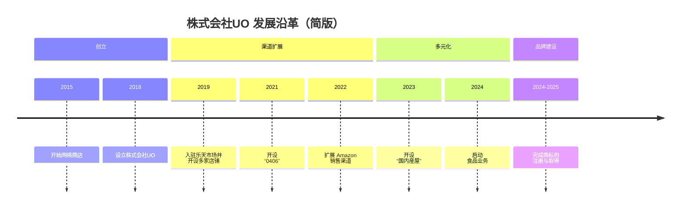

# 公司概要

## 基本信息

| 项目 | 内容 |
| --- | --- |
| 公司名称 | 株式会社UO |
| 代表董事 | 王 克兢 |
| 成立时间 | 2018 年 |
| 所在地 | 兵库县神户市长田区菅原通 2-23 No.88 大楼 2F |
| 员工人数 | 20 人 |
| 年营业额 | 2.1 亿日元（2024 财年） |
| 总部与工厂 | 神户市 |
| 主要销售渠道 | 乐天市场 / Mercari / Amazon / au PAY Market / Qoo10 / Temu / Alibaba（中国） |

## 业务内容

- **全机型手机壳的 OEM、加工与批发销售**
- **从中国直采进口定制商品并进行批发与销售**
- **包含从日本面向中国上架在内的跨境协同**
- **日本国产食品的 EC 销售业务**

## 业务体制

株式会社UO 构建了 **除 EC 店铺运营外，还能将商品企划、加工、批发销售与跨境协同一体推进的体制**。  
**能够将销售一线获得的客户理解进一步连接到下一步商品拓展与新业务之中**，正是公司的特点。

<!--
生成画像プロンプト:
A clean corporate infographic-style visual for a Japanese company, showing integrated business flow: product planning, OEM manufacturing, processing, e-commerce operations, cross-border coordination between Japan and China, shipping and customer delivery, minimal and elegant, deep blue and silver tone, modern corporate style, no text, no logo, no watermark, 16:9
-->

::: info 株式会社UO 的优势
- 能将 EC 运营、商品企划、加工与批发销售一体推进的体制
- 对多机型适配、定制化与小批量支持的灵活性
- 除日本国内销售外，也兼顾与中国协作的业务基础
:::

## 沿革

### 简版沿革

可左右滚动查看

### 详细沿革

::: timeline 2015 年
**开始网络商店业务**  
正式启动手机配件销售。
:::

::: timeline 2018 年
**设立株式会社UO**  
以法人形式完善业务基础，建立起正式推进业务拓展的体制。
:::

::: timeline 2019 年
**在乐天市场开设“松武商店”“3911”“天海スポーツ”**  
扩展主要线上销售渠道，强化销售体制。
:::

::: timeline 2021 年
**在乐天市场开设“0406”**  
进一步扩大店铺布局，持续强化 EC 运营基础。
:::

::: timeline 2022 年
**在 Amazon 开设“UOWORLD3911”“幸田良品”**  
在乐天市场之外，也进一步扩充了 Amazon 的销售渠道。
:::

::: timeline 2023 年
**在 Amazon 开设“国内産屋”**  
为新品牌的发展布局推进前期基础建设。
:::

::: timeline 2024 年 4 月
**启动日本国产食品网络销售新项目**  
开始将手机配件业务中积累的运营经验拓展到新类别。
:::

::: timeline 2024 年 7 月
**注册“国内産屋”商标**  
推进食品业务的品牌建设，并夯实对外基础。
:::

::: timeline 2025 年 2 月
**取得“国内産屋”商标**  
完成支撑品牌拓展所需的权利层面建设。
:::

## 相关页面

- [代表致辞](../message/)
- [公司信息](../)
- [业务介绍](/zh/services/)
